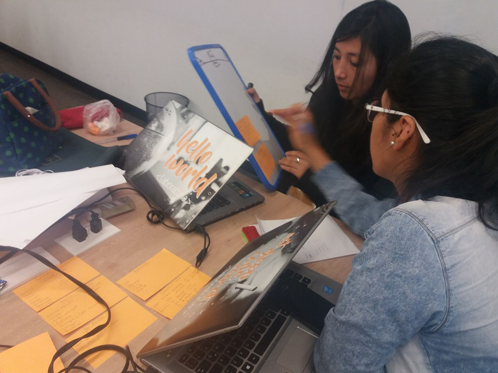
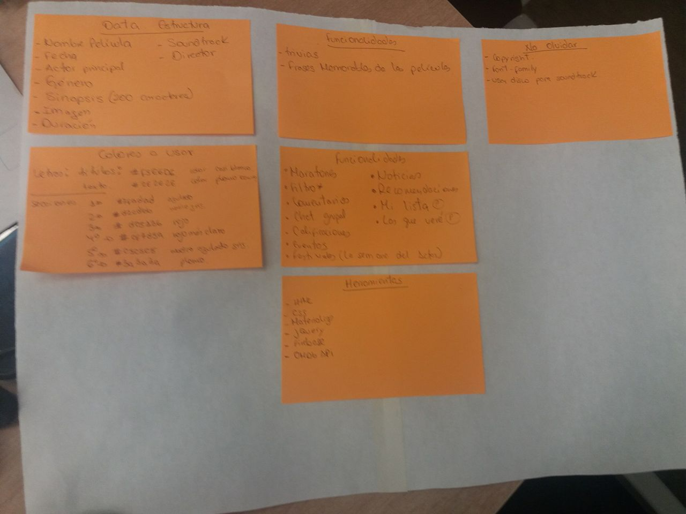
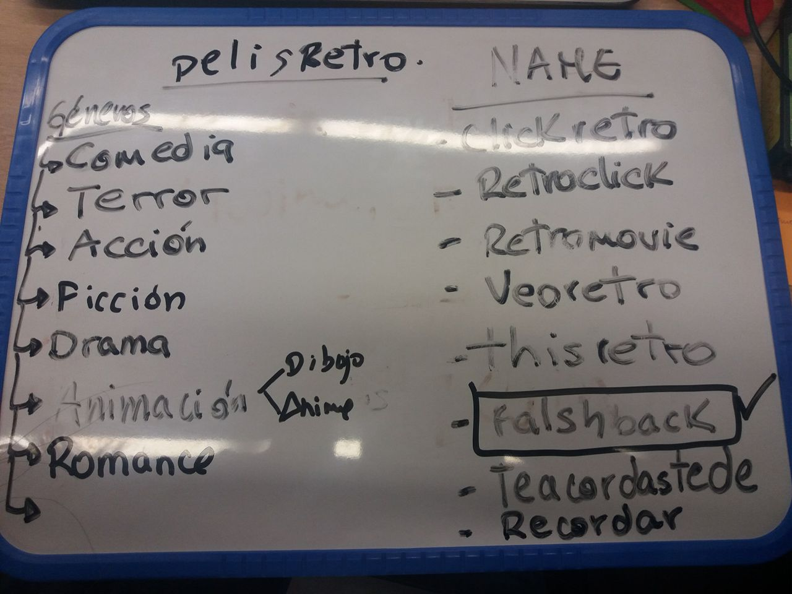
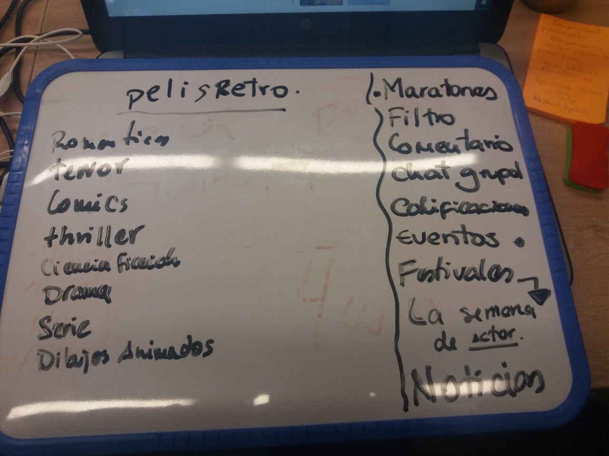
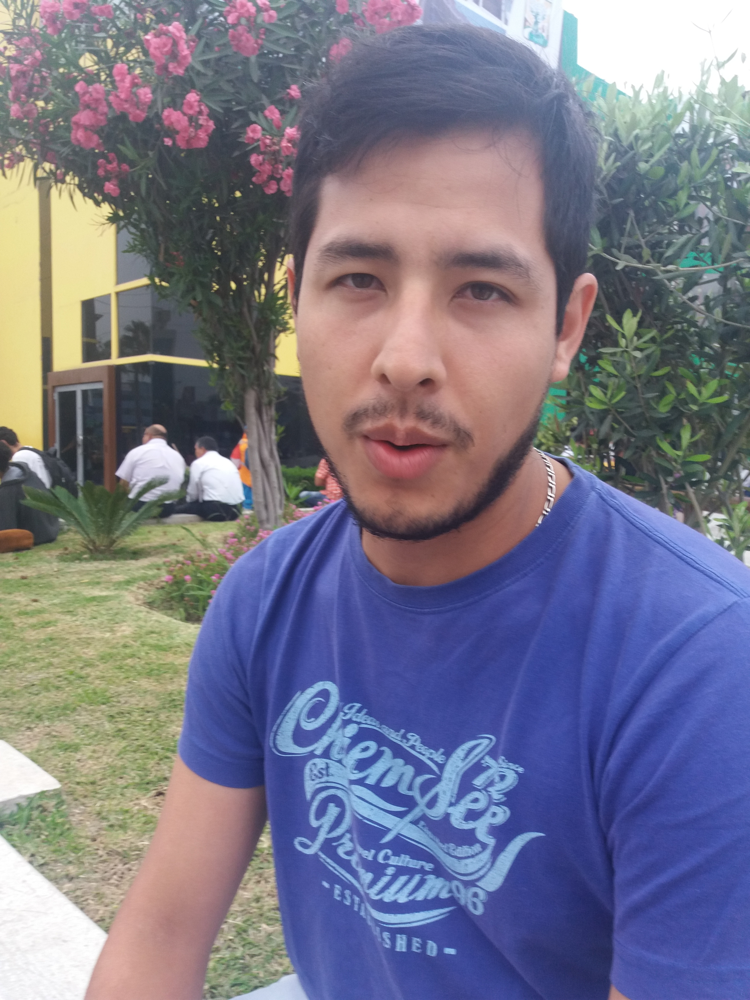
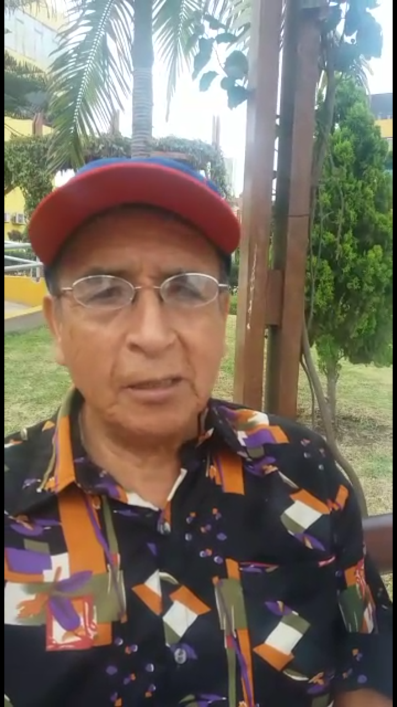
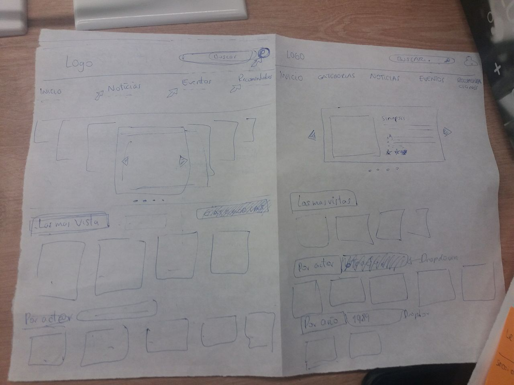
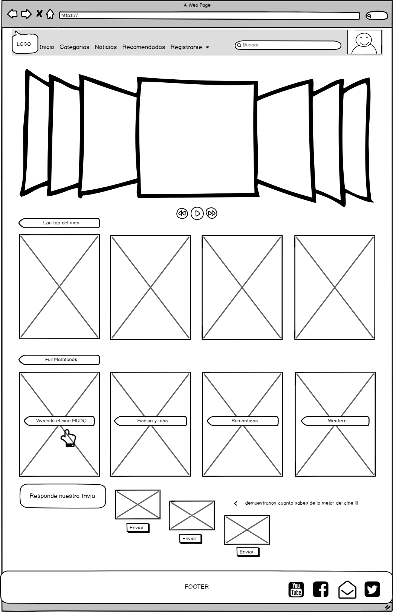
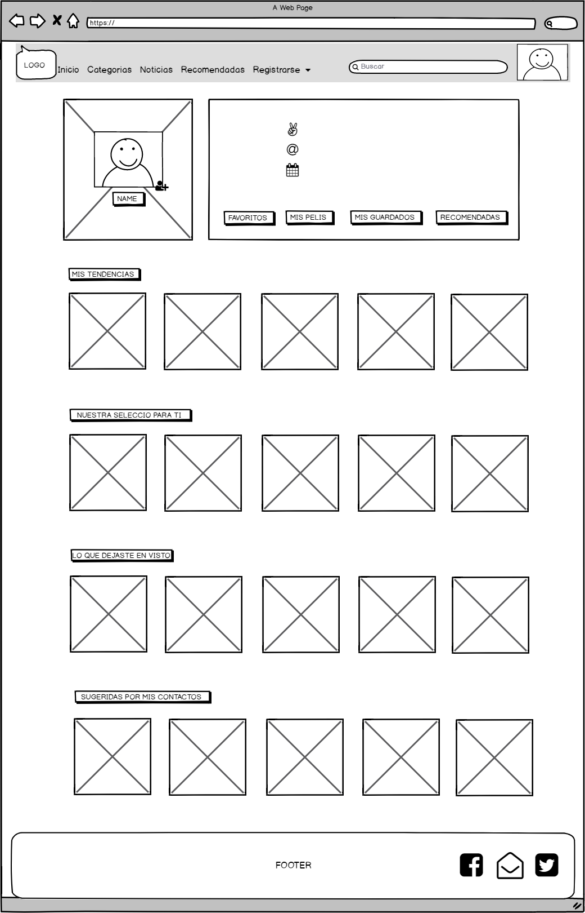
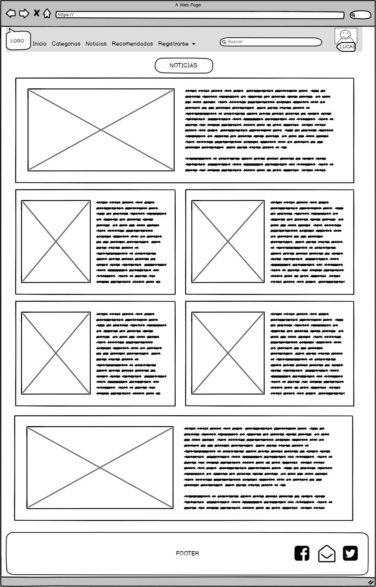

#  FLASHBACK

* Unidad: *Hackathon*
***
El presente proyecto consiste en crear un producto digital con la temática de películas.

## Problema
***
Tras una serie de preguntas al publico acerca de que quisieran ellos en una pagina web de peliculas, llegamos a la conclusión 
de que en su mayoria optaba por una web que contara con peliculas clasicas o mejor dicho antiguas.
Encontrado que la informacion brindada por internet es muy escasa y de hallarla se encuentra incompleta, es por esto que las personas se sentian inconforme con este resultado, optando por comprar material de DVD´S. Grande fue la sorpresa del usuario que el al querer hacer aquello, la tienda no contaba con el producto que este buscaba y solo le digan "Esa Titulo es muy viejo para tenerlo, solo trabajamos con lo nuevo" y en el peor de los casos de encontrar una serie o una colección, esta se encuentre incompleta o ya sea de mala calidad.

## Propuesta de Mejora o Solución
***
Ante las necesidades del publico es que se crea FLASHBACK, una plataforma Web y mobile ideal para personas de distintas edades que amen las peliculas antiguas, clasicas o series televisibas que en su momento marcaron su parte de su vida. Brindando la información detallada acerca del contenido de nustra web, para que el usuario sepa en que año fue lanzada o los actores, clasificarlo por generos entre otras cosas.

## Proceso de Desarrollo

***Planificación:** Implementación de listas de tareas y programación del tiempo.  

***Brainstorming:** Lluvia de ideas para elegir temática del producto, nombre, logo, colores y funcionalidades. 
 

<!-- lo que avance -->
 ## Nombre del Portal y Diseño del Isologo:

Decidimos llamarla 'FLAShBACK',  por que al nosotros oír esta palabra nos hace referencia a algo pasado, a algo que sucedio y recordamos. Es por ello que asociamos el nombre para la plataforma web, queriendo lograr que las personas al pensar en el nombre, recuerden algun momento que para ellos era importante  asociandolo al cine.
El Isologo surgio de la idea de "¿Que objeto tu verias y pensarias que es pasado?" es por ello que decidimos poner una camara antigua, que va asociado a la idea de pasado y teniendo que ver con el tema cinematografico.

## Nuestra Marca:

la creacion de nuestra marca tiene como finalidad evocar emoción, nostalgia, sentir la frase 'Recordar es volver a vivir'. 
La eleccion de colores tambien fue investigada, siendo los colores elejidos a usar: 

### Rojo, Amarrillo y Naranaja
El rojo es un color que se puede utilizar en la decoración vintage con mucha discreción. Son colores muy fuerte que quedan perfecto en objetos o combinado con otros tonos más suaves.

### Verde, Azul y derivados pasteles.
El verde, azul y derivados también resulta interesante al combinarlo con otros colores vintage, por ejemplo con fucsia o rosa el resultado es magnífico. Otro punto importante es el verde, que tiene toda una gama de tonalidades y puedes utilizar cualquiera de ellas para lograr el estilo vintage. Desde verde más oscuro hasta el tono verde pastel.

# Entrevistas a Usuarios
## Contenido
 Se realizó un estudio de mercado, para esto se  realizaron diferentes entrevistas a personas(grupo muestral), de diferentes rangos de edades, llegando a la conclusion  que necesitamos encontrar un portal web que reuna información y data sobre las peliculas y series antiguas.
 
 

# Organizacion de trabajo
## 1er día: 
* Silvia: Investigación sobre portales web retro, estructurar la estructura de la pagina. 
* Ambar: Investigacion sobre portales web retro, estructurar la estructura de la pagina. 
* Alejandra: Investigacion sobre API a usar, definir nuestro alcance.  
* Neiida:Investigacion sobre API a usar, definir nuestro alcance. 
## 2do día:
* Silvia: avance de flujo de la ventana index.
* Ambar: Detalles de colores y funcionalidades iniciales, aregar vistas secundarias, rediseñar el logo.
* Alejandra: Funcionalidad a base de firebase e implementación al proyecto.
* Neiida: Pruebas con el uso del API a usar e implementación al proyecto.
## 3ra día:
* Silvia: Termiando de archivo .json y detalles en funcionalidades iniciales
* Ambar: Avance  de readme (1 era parte), modificar detalles de estilos de las vistas.
* Alejandra: Funcionalidad de la pagina login y extracción de dato de archivo .json.
* Neiida: Funcionalidad de filtrados y uso de API en la extraccion de data.
## 4to  día:
* Silvia: Finalización de readme parte 2.1, pulir vistas.
* Ambar: Finalización de readme part 2.2, corregir vistas.
* Alejandra: Funcionalidad final
* Neiida:Funcionalidad final

* **Scketch:** 
Se desarrolló diversos tipos de diseño de las primeras vistas, las primeras fueron en papel, para luego finalizar los scketchs de manera virtual.

## En versión desktop :

* **Presentacion:** 

* **Profile:** 

* **Noticias:** 

## Herramientas
***

* Materialize (Framework).  
* Jquery (Librería JS).  
* Firebase (Plataforma de desarrollo).  
* OMDb API.

## Autores
***
* Nelida Sheridan Quispe Tacuri.
* Alejandra Cabrera Pérez.
* Silvia Puente de la Vega.
* Ambar Ampudia.
